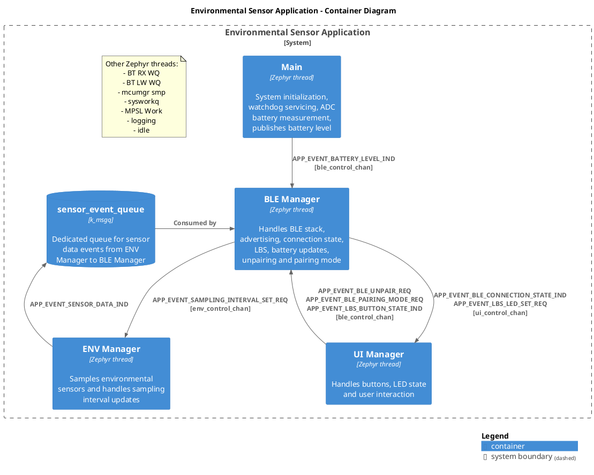

```plantuml

@startuml
!include <C4/C4_Container>

title Environmental Sensor Application - Container Diagram

System_Boundary(app, "Environmental Sensor Application") {

    Container(main_thread, "Main", "Zephyr thread", "System initialization, watchdog servicing, ADC battery measurement, publishes battery level")
    Container(ble_manager, "BLE Manager", "Zephyr thread", "Handles BLE stack, advertising, connection state, LBS, battery updates, unpairing and pairing mode")
    Container(ui_manager, "UI Manager", "Zephyr thread", "Handles buttons, LED state and user interaction")
    Container(env_manager, "ENV Manager", "Zephyr thread", "Samples environmental sensors and handles sampling interval updates")

    ContainerDb(sensor_event_queue, "sensor_event_queue", "k_msgq", "Dedicated queue for sensor data events from ENV Manager to BLE Manager")

    note as N1
    Other Zephyr threads:
    - BT RX WQ
    - BT LW WQ
    - mcumgr smp
    - sysworkq
    - MPSL Work
    - logging
    - idle
    end note
}

' ZBUS 

Rel(main_thread, ble_manager, "APP_EVENT_BATTERY_LEVEL_IND\n[ble_control_chan]")

Rel(ble_manager, ui_manager, "APP_EVENT_BLE_CONNECTION_STATE_IND\nAPP_EVENT_LBS_LED_SET_REQ\n[ui_control_chan]")

Rel(ble_manager, env_manager, "APP_EVENT_SAMPLING_INTERVAL_SET_REQ\n[env_control_chan]")

Rel(ui_manager, ble_manager, "APP_EVENT_BLE_UNPAIR_REQ\nAPP_EVENT_BLE_PAIRING_MODE_REQ\nAPP_EVENT_LBS_BUTTON_STATE_IND\n[ble_control_chan]")

' Message Queue

Rel(env_manager, sensor_event_queue, "APP_EVENT_SENSOR_DATA_IND")
Rel_R(sensor_event_queue, ble_manager, "Consumed by")

SHOW_LEGEND()
@enduml

```